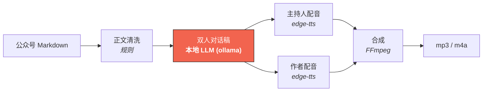

# article2pod · 文章→播客 零成本流水线

**不要钱，有篇文章，有台电脑就行。**

把一篇公众号长文 / 技术文章，变成一段**双人访谈式播客**：一位主持人提问引导，作者本人（第一人称）讲观点、讲数字、讲故事。全程跑在你自己电脑上，不花一分钱。

```
公众号文章（读）
    ├──→ book2vido → 短视频（看）    [既有项目]
    └──→ article2pod → 播客（听）    [本项目]
```

> **与 book2vido 的关系**：派生项目，同栈同理念。book2vido 做「文本→视频」（LLM 分镜 + edge-tts 配音 + Pillow 画面 + FFmpeg 合成）；article2pod 做「文章→播客」——**删掉画面环节**，LLM 改写任务从「分镜口播稿」换成「双人对话稿」，TTS 从单音色换成**双音色**（主持人 + 作者），合成从视频变成纯音频。七个环节删一个、改一个、复用五个。

## 实测区间（不是承诺值）

| | 本次实测（B19 · 18 轮对话） |
|---|---|
| 单集时长 | **157.7 s**（2 分 38 秒） |
| 输出 | mp3（977 KB）+ m4a（1.78 MB）双格式 |
| 生成耗时 | 96 s（含 LLM 改写 ~87 s） |
| 单集成本 | **≈ ¥0.0005**（纯电费，TTS 免费） |

每个对外数字的口径见 [`demo/README.md`](demo/README.md)。

## 一图看完这条链路



## 快速开始

```bash
# 1. 依赖：本地 LLM（可选但推荐）+ edge-tts + ffmpeg
ollama pull qwen3:8b
pip3 install -e .
# ffmpeg 请按平台安装

# 2. 生成：默认出「对话稿 + mp3 + m4a」
article2pod 你的文章.md -o demo/out

# 只出对话稿先审稿（推荐流程）：
article2pod 你的文章.md -o demo/out --no-tts

# 人工改完对话稿后，跳过 LLM 直接重合成：
article2pod 你的文章.md -o demo/out --use-script
```

## Web GUI（本地界面）

不需要敲命令行也可以生成播客——参考 book2vido 的本地单页界面：

```bash
python -m article2pod.gui --port 8766   # 自动开浏览器；--no-browser 不开
```

界面功能：

- **选音色**：6 个实测可用的中文音色（女：晓晓/晓伊/晓萱，男：云希/云健/云扬），主持人、作者分开选；
- **选组合**：5 个预置（知性访谈/萌系对谈/沉稳深谈/温暖陪伴/新闻质感），一点即换；
- **选语气**：natural / lively / serious / cute / story，注入对话稿 prompt；
- **选文章**：拖拽上传 .md，或填本地路径；
- **试听/下载**：成品 mp3/m4a/对话稿在线播放、下载；历史成品列表可直接回听。

> ⚠️ 音色表是 2026-09-23 实测过的：edge-tts 服务端目前只有上述 6 个中文音色可用（晓梦/晓涵/晓辰/云野/云枫/云杰会返回 NoAudioReceived，已从表里剔除）。

## 推荐工作流

**先审稿，后合成**——LLM 生成的对话稿是「人工可改的口子」：

1. `--no-tts` 生成 `script.json` / `script.md`，通读一遍；
2. 发现有事实瑕疵直接改 `script.json`（本项目曾抓出模型把腾讯 Marvis 与 MiniMax Mavis 归属搞混、编造原文没有的细节——**观点保真靠人工核**）；
3. `--use-script` 用改好的稿子直接合成，跳过 LLM（省 ~90 s，且不会被模型随机性覆盖）。

## 配置（config.yaml）

| 项 | 默认 | 说明 |
|---|---|---|
| `llm.provider` | ollama | ollama 本地模型；模型与 prompt 资产可换 |
| `llm.think` | true | qwen3 思考模式，质量优先；批量可 `--fast` |
| `tts.host_voice` | zh-CN-XiaoxiaoNeural | 主持人（女声） |
| `tts.author_voice` | zh-CN-YunxiNeural | 作者（男声，行途第一人称） |
| `limits.max_turns` | 34 | 对话轮次上限（~30 轮 ≈ 8-12 分钟成品） |
| `out.formats` | both | mp3（兼容最广）/ m4a（公众号图文内嵌推荐）/ both |

> 播客生成的核心是 `prompts/podcast_writer.md`（提示词资产）——它是「模型行为」的唯一来源，逐条约束旁写着为什么。改它不需要动代码，改完自动让对话稿缓存失效。

## 内容池与适配场景

- 适合：观点文、故事文、数字密集的方法论文——**内容点越多，讨论越有来有回**；
- 需要音频友好化的：大量代码/架构图的纯技术文（LLM 会做"描述替代展示"，或保留"想听细节读原文"的引导）；
- 微信生态：输出 m4a 可直接做公众号图文内嵌音频（≤200M、1-2 小时上限），音频无原创声明，价值在引流回原文。

## 目录结构

```
article2pod/
├── config.yaml              # 配置 SSoT
├── prompts/
│   └── podcast_writer.md    # 对话稿提示词资产（模型行为唯一来源）
├── src/article2pod/
│   ├── llm.py               # 本地 LLM：文章 → 对话稿（契约校验）
│   ├── tts.py               # 双音色 TTS（并发/重试/降并发/超时保护）
│   ├── compose.py           # FFmpeg 合成（句间静音 + mp3/m4a）
│   └── pipeline.py          # 编排
├── demo/
│   ├── out_B19/             # 第一篇实测成品（稿 + mp3 + m4a）
│   └── README.md            # Demo 说明与口径
└── voices/                  # 音色预览
```

## 关于作者

我是**行途**，一线技术人 + 仍在写代码。这套「文章→播客」流水线来自我把公众号长文转成双人对话播客的真实需求——不烧 API、本地跑完，单集成本约 ¥0.0005。

- 🔔 公众号 **「行途技术手记」**：微信搜索关注，看 AI 工程化落地实战
- 🐙 GitHub：[@xingtu1996](https://github.com/xingtu1996)
- 📦 仓库：[xingtu1996/article2pod](https://github.com/xingtu1996/article2pod)

---


## License

MIT
