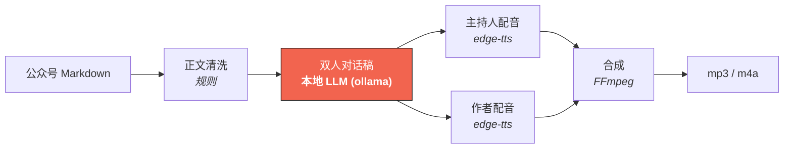

# article2pod · 文章→播客 零成本流水线

**不要钱，有篇文章，有台电脑就行。**

把一篇公众号长文 / 技术文章，变成一段**双人访谈式播客**：一位主持人提问引导，作者本人（第一人称）讲观点、讲数字、讲故事。全程跑在你自己电脑上，不花一分钱。

```
公众号文章（读）
    ├──→ book2vido → 短视频（看）    [既有项目]
    └──→ article2pod → 播客（听）    [本项目]
```

> **与 book2vido 的关系**：派生项目，同栈同理念。book2vido 做「文本→视频」（LLM 分镜 + edge-tts 配音 + Pillow 画面 + FFmpeg 合成）；article2pod 做「文章→播客」——**删掉画面环节**，LLM 改写任务从「分镜口播稿」换成「双人对话稿」，TTS 从单音色换成**双音色**（主持人 + 作者），合成从视频变成纯音频。七个环节删一个、改一个、复用五个。

## 实测区间（不是承诺值）

| | 本次实测（B19 · 18 轮对话） |
|---|---|
| 单集时长 | **157.7 s**（2 分 38 秒） |
| 输出 | mp3（977 KB）+ m4a（1.78 MB）双格式 |
| 生成耗时 | 96 s（含 LLM 改写 ~87 s） |
| 单集成本 | **≈ ¥0.0005**（纯电费，TTS 免费） |

每个对外数字的口径见 [`demo/README.md`](demo/README.md)。

## 一图看完这条链路


```mermaid
flowchart LR
    A["公众号 Markdown"] --> B["正文清洗<br/><i>规则</i>"]
    B --> C["双人对话稿<br/><b>本地 LLM (ollama)</b>"]
    C --> D["主持人配音<br/><i>edge-tts</i>"]
    C --> E["作者配音<br/><i>edge-tts</i>"]
    D --> F["合成<br/><i>FFmpeg</i>"]
    E --> F
    F --> G["mp3 / m4a"]

    style C fill:#F2644F,color:#fff,stroke:#1A1A1A
```

## 安装与快速开始

### 前置条件

| 依赖 | 必需 | 干什么用 | 怎么确认 | 怎么装 |
|---|---|---|---|---|
| Python ≥ 3.10 | ✅ | 跑代码 | `python3 --version` | 系统自带 / python.org |
| `ffmpeg` + `ffprobe` | ✅ | 合成音频、回读时长 | `ffmpeg -version` | macOS `brew install ffmpeg`；Debian/Ubuntu `apt install ffmpeg` |
| `ollama` + `qwen3:8b` | 推荐（不要就是降级路径） | 写「双人访谈」对话稿 | `ollama list` 里有 `qwen3:8b` | `brew install ollama` 后 `ollama pull qwen3:8b` |
| `edge-tts` | ✅（pip 自动装） | 配音，免费匿名但要联网 | `pip show edge-tts` | 随 `pip install -e .` 装 |
| macOS `say` | 兜底 | 断网/限流时本地配音 | `which say` | macOS 自带 |

### 三条命令跑通

```bash
python3 -m venv .venv && source .venv/bin/activate   # 1. 建环境
pip install -e .                                      # 2. 装依赖（含 article2pod 命令）
article2pod demo/samples/sample_article.md -o demo/out # 3. 出播客
```

第 3 条默认产出「对话稿 + mp3 + m4a」三件套。仓库自带一篇示例文章 `demo/samples/sample_article.md`，装完就能跑，不用自己找素材。

### 两条路径：要不要 ollama

| | 路径 A（推荐） | 路径 B（零依赖降级） |
|---|---|---|
| 前置 | `ollama serve` 在跑 + 已 `ollama pull qwen3:8b` | **什么都不要** |
| 怎么切 | 默认就是（config.yaml `llm.provider: ollama`） | 改 `config.yaml` → `llm.provider: rule` |
| 产出 | 真正的双人访谈稿：主持人提问、作者讲观点 | **不是对话稿**——作者句为原文照搬，只保证链路能跑通 |
| 本次实测 | 26 轮 · 音频 142.6 s · mp3 812 KB / m4a 1.45 MB · 耗时 147.9 s | 32 轮 · 音频 187.8 s · mp3 1.01 MB / m4a 1.83 MB · 耗时 21.3 s |

> 口径：同一篇 705 字示例文章，M 系列本机，端到端计时；时长为 `ffprobe format.duration` 回读。你的机器和模型不同，数字会变。
> 路径 B 存在的意义是「没模型也能验证整条链路」，**出成品请用路径 A**。

### 推荐工作流（先审稿，后合成）

```bash
article2pod 你的文章.md -o demo/out --no-tts     # 只出对话稿，通读一遍
# 改 demo/out/script.json（事实瑕疵必须人工核）
article2pod 你的文章.md -o demo/out --use-script # 用改好的稿重合成，跳过 LLM
```

### 输入支持范围

目前**只吃本地 UTF-8 纯文本**（`.md` / `.txt` 都行），**不支持 URL/公众号链接/网页抓取**。
为什么、以及 `article2pod fetch <url>` 的设计方案与选型实测，见 [`doc/BLOG_INPUT_ANALYSIS.md`](doc/BLOG_INPUT_ANALYSIS.md)。

## 常见报错对照表

| 报错 | 真正的原因 | 怎么办 |
|---|---|---|
| `ModuleNotFoundError: No module named 'yaml'` | 依赖没装 | `pip install -r requirements.txt`（或 `pip install -e .`） |
| `command not found: article2pod` | 没装成命令行，或 venv 没激活 | `source .venv/bin/activate` 后 `pip install -e .` |
| `Ollama 调用失败 … Connection refused` | `ollama serve` 没跑 | 另开一个终端跑 `ollama serve`；或切路径 B |
| `Ollama 调用失败 … HTTP Error 502` | 服务起来了但模型没拉 / 加载失败 | `ollama pull qwen3:8b`，再 `ollama list` 确认 |
| `NoAudioReceived`（TTS 日志里的 warn） | edge-tts 服务端限流或音色失效 | 已内置重试 + 自适应降并发；仍失败会自动回退 macOS `say`，成品不受影响。频繁出现就换个音色 |
| `FileNotFoundError: 提示词资产不存在` | `config.yaml` 的 `llm.prompt_file` 填了错路径 | 填 `null` 用默认 `prompts/podcast_writer.md` |
| `UnicodeDecodeError` | 文章不是 UTF-8 编码 | 转成 UTF-8 再喂（`iconv -f GBK -t UTF-8 a.txt > b.md`） |
| `FileNotFoundError: 文章不存在` | 路径写错 / 相对路径基准不对 | 用绝对路径，或先 `pwd` 确认当前目录 |
| `[error] 合成失败` / `ffmpeg: command not found` | 没装 ffmpeg | `brew install ffmpeg`（Linux 用 apt） |
| `对话稿必须以 host 开场` / `角色未交替` | 模型没服从 prompt（偶发） | 重跑一次；或 `--no-tts` 出稿后手工改 `script.json` 再 `--use-script` |
| `[in] 正文 N 字 > 上限 12000` | 长文被**静默截断**（只留开头） | 调大 `config.yaml` 的 `limits.max_chars`，或先自己压一遍 |
| 裸跑 `pytest` 报 `No module named 'numpy'` | 扫到了 `demo/cosyvoice_demo`（第三方模型仓库） | 已用 `testpaths = ["tests"]` 钉死；直接 `pytest -q` 即可 |

## Web GUI（本地界面）

不需要敲命令行也可以生成播客——参考 book2vido 的本地单页界面：

```bash
python -m article2pod.gui --port 8766   # 自动开浏览器；--no-browser 不开
```

界面功能：

- **选音色**：6 个实测可用的中文音色（女：晓晓/晓伊/晓萱，男：云希/云健/云扬），主持人、作者分开选；
- **选组合**：5 个预置（知性访谈/萌系对谈/沉稳深谈/温暖陪伴/新闻质感），一点即换；
- **选语气**：natural / lively / serious / cute / story，注入对话稿 prompt；
- **选文章**：拖拽上传 .md，或填本地路径；
- **试听/下载**：成品 mp3/m4a/对话稿在线播放、下载；历史成品列表可直接回听。

> ⚠️ 音色表是 2026-09-23 实测过的：edge-tts 服务端目前只有上述 6 个中文音色可用（晓梦/晓涵/晓辰/云野/云枫/云杰会返回 NoAudioReceived，已从表里剔除）。

## 推荐工作流

**先审稿，后合成**——LLM 生成的对话稿是「人工可改的口子」：

1. `--no-tts` 生成 `script.json` / `script.md`，通读一遍；
2. 发现有事实瑕疵直接改 `script.json`（本项目曾抓出模型把腾讯 Marvis 与 MiniMax Mavis 归属搞混、编造原文没有的细节——**观点保真靠人工核**）；
3. `--use-script` 用改好的稿子直接合成，跳过 LLM（省 ~90 s，且不会被模型随机性覆盖）。

## 配置（config.yaml）

| 项 | 默认 | 说明 |
|---|---|---|
| `llm.provider` | ollama | ollama 本地模型；模型与 prompt 资产可换 |
| `llm.think` | true | qwen3 思考模式，质量优先；批量可 `--fast` |
| `tts.host_voice` | zh-CN-XiaoxiaoNeural | 主持人（女声） |
| `tts.author_voice` | zh-CN-YunxiNeural | 作者（男声，行途第一人称） |
| `limits.max_turns` | 34 | 对话轮次上限（~30 轮 ≈ 8-12 分钟成品） |
| `out.formats` | both | mp3（兼容最广）/ m4a（公众号图文内嵌推荐）/ both |

> 播客生成的核心是 `prompts/podcast_writer.md`（提示词资产）——它是「模型行为」的唯一来源，逐条约束旁写着为什么。改它不需要动代码，改完自动让对话稿缓存失效。

## 内容池与适配场景

- 适合：观点文、故事文、数字密集的方法论文——**内容点越多，讨论越有来有回**；
- 需要音频友好化的：大量代码/架构图的纯技术文（LLM 会做"描述替代展示"，或保留"想听细节读原文"的引导）；
- 微信生态：输出 m4a 可直接做公众号图文内嵌音频（≤200M、1-2 小时上限），音频无原创声明，价值在引流回原文。

## 目录结构

```
article2pod/
├── config.yaml              # 配置 SSoT
├── prompts/
│   └── podcast_writer.md    # 对话稿提示词资产（模型行为唯一来源）
├── src/article2pod/
│   ├── llm.py               # 本地 LLM：文章 → 对话稿（契约校验）
│   ├── tts.py               # 双音色 TTS（并发/重试/降并发/超时保护）
│   ├── compose.py           # FFmpeg 合成（句间静音 + mp3/m4a）
│   └── pipeline.py          # 编排
├── demo/
│   ├── out_B19/             # 第一篇实测成品（稿 + mp3 + m4a）
│   └── README.md            # Demo 说明与口径
├── tests/                   # 冒烟测试（不碰网络/模型/ffmpeg）
├── doc/                     # 设计分析文档
└── voices/                  # 音色预览
```

## 关于作者

我是**行途**，一线技术人 + 仍在写代码。这套「文章→播客」流水线来自我把公众号长文转成双人对话播客的真实需求——不烧 API、本地跑完，单集成本约 ¥0.0005。

- 🔔 公众号 **「行途技术手记」**：微信搜索关注，看 AI 工程化落地实战
- 🐙 GitHub：[@xingtu1996](https://github.com/xingtu1996)
- 📦 仓库：[xingtu1996/article2pod](https://github.com/xingtu1996/article2pod)

---


## License

MIT
